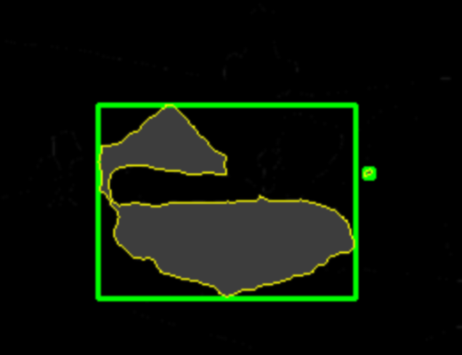

# Basic-image-segmentation-using-Keras-per-the-work-of-Divamgupta
Using Pre-trained models to isolate features in photo

Image-Segmentation-using-Keras-Segmentation-per-the-work-of-Divamgupta
This repository came from Divamgupta's GitHub repository on Image Segmentation Keras:

https://github.com/divamgupta/image-segmentation-keras

This repository is based on studying Divamgupta's GitHub repository, blog and other written materials  that I have found online. This is great work and a real help to a novice such as myself. I will be creating a few repositories using my interpretation of how this all might be implemented. I might be wrong, so any constructive criticism is welcome.

This first repository will be based on using Divamgupta's pre-trained example shown in his Readme file. We use the pretrained code to create segmentation items from a photo using load_pretrain_and_create_image.py driven from an xterm. 

In this implementation we interactively select the pixel value associated with a particular segment in the photograph that we are trying to isolate. The python program is interactive_plots_with_box.py. 

In this example we are working with the the bedroom picture under the sample_images subdirectory (1_input.jpg). After discriminating all of the major features in the photo as shown above, we then isolate a particular item in the picture (bed), and create a subsequent image showing just that feature with a green rectangle around it. Nothing fancy. 

We are working in Ubuntu and each python .py program is driven from an xterm using 'python xxxx.py' as the command. 

A second repository will be similar to this will except we will be using the kMean clusters for image segmentation as presented by Vidhya. Once we perfrom the image segmentation we will be repeating the same type of segment discrimination as used in this repository.

Our primary goal is to categorize the different types of grains observed in a clastic petrographic thin sections. This is work in progress. We will also estimate the Petrophysical Rock Types and Petrophysical properties from a clastic Thin Section photomicrograph.

