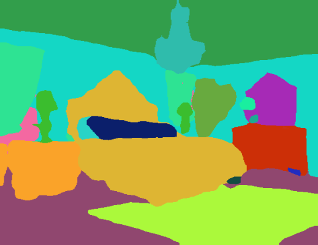
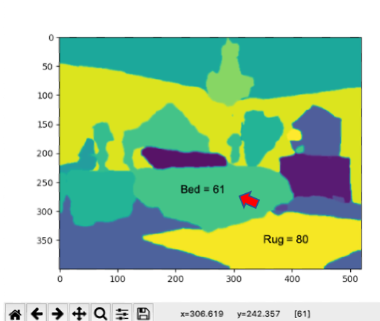

# Image-Segmentation-using-Keras-Segmentation-per-the-work-of-Divam-Gupta
This repository initially came from Divam Gupta's GitHub repository on Image Segmentation using Keras:

https://github.com/divamgupta/image-segmentation-keras

This repository is based on studying Divam Gupta's GitHub repository, blog and other written materials that we have found online. This is great work and a real resource to a novice such as myself. we will be creating a few repositories using our interpretation of how this all might be implemented. We might be wrong, so any constructive criticism is welcome.

## Original Photo
This first repository will be based on using Divam Gupta's pre-trained examples shown in his Readme file. This is the original photo that we are working from:

## Pre-Trained Models
We use the pre-trained code to create segmentation items from the above photo using load_pretrain_and_create_image.py driven from an xterm. The following pre-pretrain models are available, but we have found the pspnet_50_ADE_20K to work the best in this instance.

model = pspnet_50_ADE_20K() # in between detail - load the pretrained model trained on ADE20k dataset

#model = pspnet_101_cityscapes() # too much detail - load the pretrained model trained on Cityscapes dataset

#model = pspnet_101_voc12() # Just the People - load the pretrained model trained on Pascal VOC 2012 dataset

## Segment Predictions
Our pre-trained model prediction is made with just a few lines of code shown below,

out = model.predict_segmentation(
    inp="sample_images/1_input.jpg",
    out_fname="bed_out.png"
)

and the following image is the predicted image segmentation from the original bedroom photo shown above. 

## Interactive Program to Identify Segmented Features
To determine the segment or item(s) values that we want to isolate, we interactively scan the photo taking note of the pixel values associated with the segments in the photograph that we are trying to isolate. The python program for this program is interactive_plots_with_box.py. As can be seen below, the bed has a value of 61 and the rug has a value of 80. 

In this instance we only label the segment for the bed or value 61. 

    label = np.zeros(data.shape )
    label[data ==61]  = 61 #bed

We are working with a bedroom picture under the sample_images subdirectory (1_input.jpg). After discriminating all of the major features in the photo as shown above, we can then isolate a particular item in the picture (bed), and create a subsequent image showing just that feature with a green rectangle around it. 

We are working in Ubuntu and each python program is driven from an xterm command line using 'python xxxx.py' as the command. 

